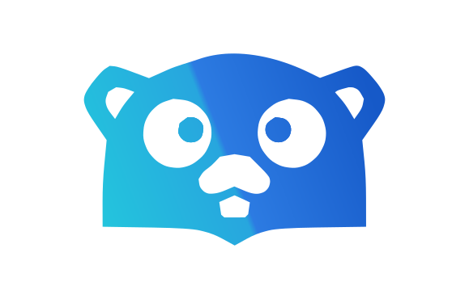

<!-- togo-header -->
<div align="center">
  
  <h1>togo-framework/live-whatsapp</h1>
  <p>
    <a href="https://to-go.dev/marketplace"></a>
    <a href="https://pkg.go.dev/github.com/togo-framework/live-whatsapp"></a>
    
  </p>
  <p><strong>WhatsApp channel driver for the <a href="https://to-go.dev">togo</a> <code>live</code> plugin.</strong></p>
</div>
<!-- togo-header -->

## Install

```bash
togo install togo-framework/live-whatsapp
```

Blank-import the package to activate it; the [`live`](https://to-go.dev/plugins/live)
plugin picks up the registered `whatsapp` channel automatically.

```go
import _ "github.com/togo-framework/live-whatsapp"
```

## What it does

- **Egress** — delivers an agent's reply out to a WhatsApp thread via the
  WhatsApp Cloud (Graph) API. The recipient is the conversation's
  `external_ref` (the customer's `wa_id` / msisdn).
- **Ingress** — mounts a Meta webhook that verifies the subscription handshake
  and ingests inbound text messages as user prompts on the matching conversation.

## Configuration

| Env | Required | Default | Description |
|---|---|---|---|
| `WHATSAPP_TOKEN` | yes | — | Graph API bearer token |
| `WHATSAPP_PHONE_ID` | yes | — | Sender phone number id |
| `WHATSAPP_API` | no | `https://graph.facebook.com/v21.0` | Graph API base URL |
| `WHATSAPP_VERIFY_TOKEN` | yes (ingress) | — | Webhook verification handshake secret |

If `WHATSAPP_TOKEN` / `WHATSAPP_PHONE_ID` are empty, delivery is a no-op.

## Webhook URLs

Point your Meta app's WhatsApp webhook at:

| Method | Path | Purpose |
|---|---|---|
| `GET` | `/api/live/channels/whatsapp/webhook` | Meta verification handshake |
| `POST` | `/api/live/channels/whatsapp/webhook` | Inbound message delivery |

---

<!-- togo-sponsors -->
<div align="center">
  <h3>Premium sponsors</h3>
  <p>
    <a href="https://id8media.com"><strong>ID8 Media</strong></a> &nbsp;·&nbsp;
    <a href="https://one-studio.co"><strong>One Studio</strong></a>
  </p>
  <p><sub>Support togo — <a href="https://github.com/sponsors/fadymondy">become a sponsor</a>.</sub></p>
</div>
<!-- togo-sponsors -->
